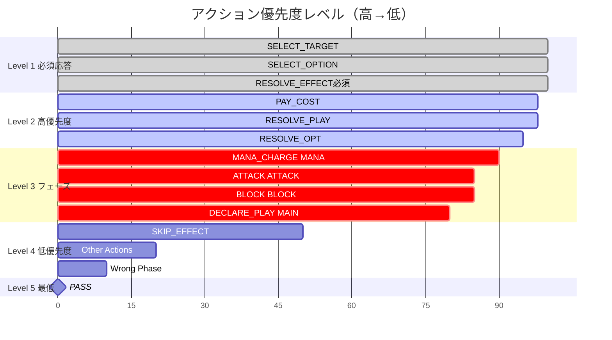

```mermaid
gantt
    title アクション優先度レベル（高→低）
    dateFormat X
    axisFormat %s
    
    section Level 1 必須応答
    SELECT_TARGET     :done, l1a, 0, 100
    SELECT_OPTION     :done, l1b, 0, 100
    RESOLVE_EFFECT必須:done, l1c, 0, 100
    
    section Level 2 高優先度
    PAY_COST          :active, l2a, 0, 98
    RESOLVE_PLAY      :active, l2b, 0, 98
    RESOLVE_OPT       :active, l2c, 0, 95
    
    section Level 3 フェーズ
    MANA_CHARGE MANA  :crit, l3a, 0, 90
    ATTACK ATTACK     :crit, l3b, 0, 85
    BLOCK BLOCK       :crit, l3c, 0, 85
    DECLARE_PLAY MAIN :crit, l3d, 0, 80
    
    section Level 4 低優先度
    SKIP_EFFECT       :l4a, 0, 50
    Other Actions     :l4b, 0, 20
    Wrong Phase       :l4c, 0, 10
    
    section Level 5 最低
    PASS              :milestone, l5, 0, 0
```
