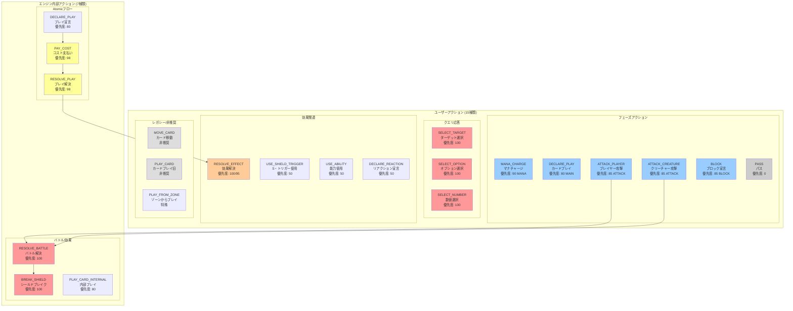

> **Legacy Terminology Note:**
> This document uses the term "Action" to describe player moves and game state transitions.
> In the current implementation, these are implemented as `CommandDef` structures within the Command System.
> The high-level logic described here remains valid, but "Action" should be interpreted as "Command" or "Player Intent".

